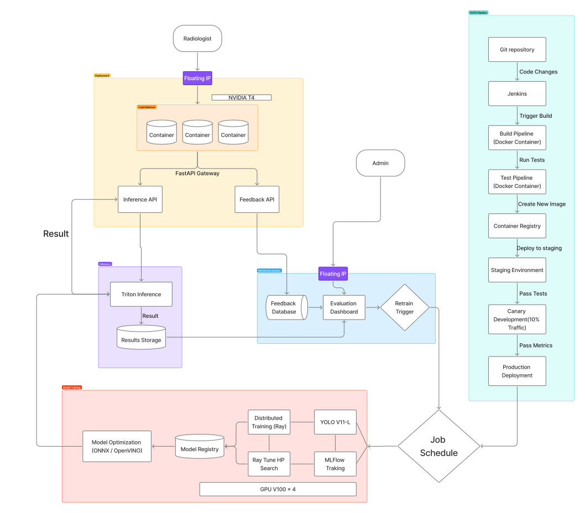

# Chest X-ray Abnormality Detection System: Serving and Monitoring

An AI-powered chest X-ray analysis system designed to assist radiologists in detecting abnormalities with high accuracy and efficiency. Built on the YOLOv11-L model architecture and trained on the VinDr-CXR dataset, this system delivers real-time inference capabilities with comprehensive monitoring and feedback integration.

## 🚀 Overview

This system provides production-ready serving and monitoring infrastructure for chest X-ray abnormality detection. Deployed on Chameleon Cloud with a microservices architecture, it ensures scalability, reliability, and continuous improvement through automated feedback loops.

### ⭐ Key Features

**High-Performance Model Serving**
- YOLOv11-L deployment via Triton Inference Server
- GPU and CPU inference optimization
- Sub-200ms latency for real-time analysis
- Batch processing at >30 FPS throughput

**Advanced Performance Optimizations**
- ONNX model conversion for cross-platform compatibility
- Dynamic and static quantization techniques
- Hardware-specific execution providers (CUDA, TensorRT)
- Multi-instance scaling and dynamic batching

**Comprehensive Monitoring**
- Real-time metrics tracking with Prometheus and Grafana
- Performance degradation detection and alerting
- Business metrics for radiologist workflow efficiency
- Automated model retraining triggers

**Intelligent Feedback Integration**
- Low-confidence prediction flagging
- MinIO and Label Studio integration for data management
- Streamlit dashboard for feedback visualization
- Continuous learning pipeline for model improvement

### 💡 Value Proposition

**For Radiologists:**
- **Reduce Missed Pathologies** - AI highlights potential abnormalities to minimize oversight
- **Improve Workflow Efficiency** - Fast inference speeds streamline image review processes
- **Maintain Diagnostic Confidence** - Reliable performance monitoring ensures consistent AI support

**For Healthcare Organizations:**
- **Scalable Infrastructure** - Cloud-native architecture supports growing workloads
- **Quality Assurance** - Continuous monitoring and feedback loops maintain system accuracy
- **ROI Tracking** - Business metrics demonstrate time savings and diagnostic improvements

## 🏗️ System Architecture

### Model Serving Infrastructure

**API Framework**
- FastAPI wrapper around Triton Inference Server
- Asynchronous request handling for high concurrency
- RESTful endpoints for chest X-ray image processing
- Structured output with bounding boxes and confidence scores

**Performance Specifications**
- **Model Size**: Optimized to <10MB (exploring <5MB for edge deployment)
- **Latency**: <200ms median inference time (single samples, server-grade GPU)
- **Throughput**: >30 FPS batch processing capability
- **Concurrency**: 5-10 simultaneous requests with minimal latency impact

**Optimization Pipeline**
1. **Model Conversion**: PyTorch → ONNX for deployment flexibility
2. **Quantization**: Dynamic/static quantization using ONNX Runtime and OpenVINO
3. **Hardware Acceleration**: CUDA and TensorRT execution providers for GPU optimization
4. **Batch Processing**: Intelligent request aggregation for throughput maximization
5. **Load Balancing**: Multi-GPU instance deployment with resource optimization

### Monitoring and Evaluation Framework

**Multi-Tier Evaluation Strategy**

*Offline Evaluation*
- VinDr-CXR test set validation (~3,600 images)
- Standard metrics: mAP@0.5 for detection accuracy
- Domain-specific metrics: Per-pathology sensitivity (pneumothorax, etc.)
- Robustness testing: Gaussian noise and occlusion resistance
- MLflow experiment tracking and model versioning

*Staging Environment Testing*
- Simulated chest X-ray processing workloads
- Throughput and latency benchmarking
- Grafana dashboard visualization
- Prometheus metrics collection and analysis

*Production Canary Deployment*
- Artificial CXR upload testing
- <100ms latency target monitoring
- Simulated sensitivity tracking
- Real-time performance visualization

**Business Intelligence Metrics**
- **Radiologist Efficiency**: Baseline vs. AI-assisted processing time comparisons
- **Diagnostic Accuracy**: Missed pathology rate analysis using VinDr-CXR ground truth
- **System Reliability**: Model degradation detection and automated retraining triggers

**Feedback Loop Architecture**
1. **Prediction Confidence Analysis**: Automatic flagging of uncertain predictions
2. **Simulated Review Process**: Artificial radiologist feedback generation
3. **Data Pipeline**: MinIO storage and Label Studio integration
4. **Retraining Automation**: Trigger-based model updates with new labeled data
5. **Performance Tracking**: Streamlit dashboard for feedback data visualization

## 🛠️ Infrastructure Requirements

| Resource Type     | Specification          | Purpose                                         |
|-------------------|------------------------|-------------------------------------------------|
| **GPU Compute**   | 1x `gpu_p100`          | Primary model inference processing              |
| **Training GPU**  | 4x A100 GPUs           | Optional retraining and model development       |
| **Network**       | 2 Floating IPs         | API serving (1) and monitoring dashboard (1)   |
| **Storage**       | 250GB Object Storage   | VinDr-CXR dataset and feedback data archive    |
| **Persistence**   | 10GB Persistent Volume | Model checkpoints and system logs              |

## 📦 Technology Stack and Dependencies

| Component                     | Source & Documentation                      | License & Usage Terms                             |
|-------------------------------|---------------------------------------------|---------------------------------------------------|
| **VinDr-CXR Dataset**         | [Research Paper](https://arxiv.org/pdf/2012.15029) | Academic use - see [usage notes](https://arxiv.org/pdf/2012.15029) |
| **YOLOv11-L Model**           | [Ultralytics Docs](https://docs.ultralytics.com/models/yolo11/) | [AGPL-3.0 License](https://www.ultralytics.com/legal/agpl-3-0-software-license) |
| **Triton Inference Server**   | [NVIDIA Documentation](https://docs.nvidia.com/triton-inference-server/) | Apache-2.0 License                               |
| **ONNX Runtime**              | [Official Documentation](https://onnxruntime.ai/) | MIT License                                       |
| **Prometheus Monitoring**     | [Prometheus Docs](https://prometheus.io/docs/) | Apache-2.0 License                               |
| **Grafana Dashboards**        | [Grafana Documentation](https://grafana.com/docs/) | AGPL-3.0 License                                 |
| **Streamlit Interface**       | [Streamlit Documentation](https://docs.streamlit.io/) | Apache-2.0 License                               |
| **Label Studio**              | [Label Studio Docs](https://labelstud.io/) | Apache-2.0 License                               |
| **MinIO Storage**             | [MinIO Documentation](https://docs.min.io/) | AGPL-3.0 License                                 |

## 🚀 Advanced Capabilities

### Multi-Platform Deployment Strategy

**GPU-Optimized Serving (Chameleon Cloud)**
- Triton Inference Server with CUDA/TensorRT acceleration
- Optimized for minimum latency and maximum throughput
- Production-ready with horizontal scaling capabilities

**CPU-Based Inference**
- ONNX Runtime with OpenVINO optimization
- Alternative deployment option for cost-sensitive environments
- Maintained performance benchmarking against GPU implementation

**Edge Computing Readiness**
- Aggressive model quantization and pruning research
- Target: <5MB model size for resource-constrained devices
- Simulated benchmarks for ARM Cortex A76 processors
- Conceptual framework for distributed inference

### Intelligent System Monitoring

**Data Drift Detection**
- Automated dataset shift monitoring (testing branch)
- Statistical analysis of input data distribution changes
- Integrated alerting system for model performance degradation
- Streamlit dashboard integration for drift visualization

**Automated Feedback Pipeline**
- Confidence-based prediction bucketing system
- Automated MinIO data upload and Label Studio integration
- Trigger-based model retraining workflow
- Performance impact tracking and validation

## 📄 License

This project is licensed under the **GNU Affero General Public License v3.0 (AGPL-3.0)**. 

Individual dependencies maintain their respective licensing terms as detailed in the technology stack table above. Please review each component's license requirements before deployment in commercial environments.
